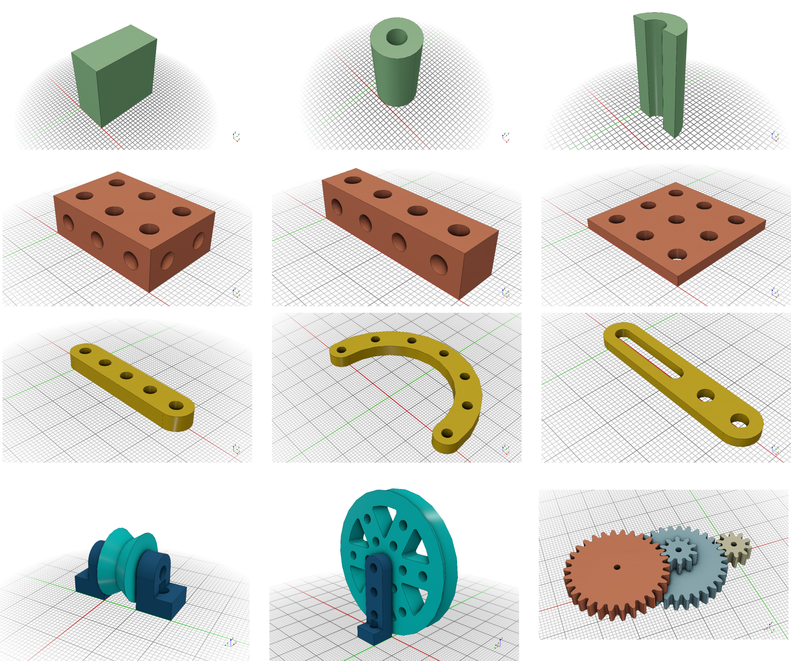
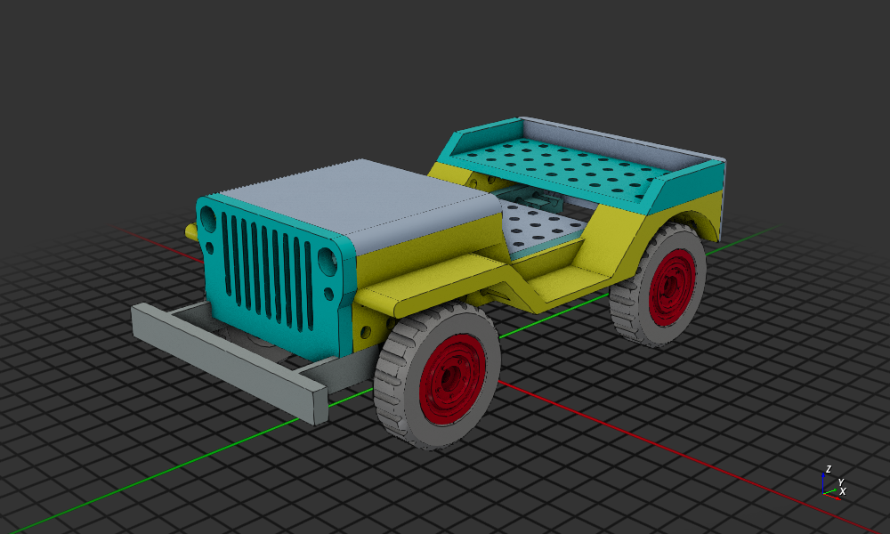

# STEMFIE-X-CadQuery-Edition

[STEMFIE](https://www.stemfie.org/) is a construction kit for children, authored by [Paulo Kiefe](https://www.stemfie.org/about). The idea of the project is based on the design and 3D printing of universal components and connecting elements and the subsequent construction of own models.

For the parametric design of kit components (beams, braces ...) of various shapes and sizes [Brendon Collecutt](https://github.com/Cantareus/Stemfie_OpenSCAD/blob/main/docs/stemfie.scad.md) created a parametric library for openSCAD program. Other graphic programs and design CAD systems such as FreeCAD, Blender, and Tinkercad can also be used to design and construct models.

The **STEMFIE-X** kit uses the basic principles of the STEMFIE project with modifications for use as a platform for creating more complex structures and models using mechanical and electronic elements - motors, servos, electronic circuits and control by microcontrollers. The building kit is primarily intended for polytechnic teaching at secondary schools and the first semesters of universities in the teaching of parametric modeling, CAD systems, constructions of machines and mechanisms.

**STEMFIE-X CadQuery Edition** is reimplementation of the STEMFIE-X library for Python on the CadQuery platform. The library consists of a set of classes, with the help of which it is possible to create and modify basic as well as derived components of the kit. When creating components, you can use all the features of the Python language as well as the advanced capabilities of the OpenCascade platform. The basic unit in the library is BU (Basic Unit, typically 10mm), which is used to define elementary components and library commands.

When creating models, it is possible to use the connection of elementary components or by combining them, it is possible to create specialized components using the program. Standard M4 screws and commonly available accessories are used as connecting elements of the components.

